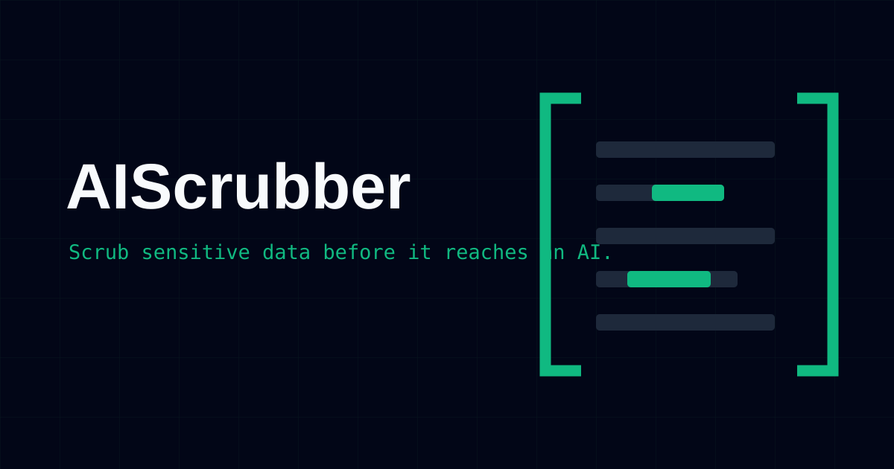

<p align="center"></p>

# AIScrubber



AIScrubber is my browser-local text redaction desk. I built it for the moment before a draft goes into an AI service, issue, email, or shared document: the text is useful, but some of the details inside it are not meant to travel with it.

[Open AIScrubber](https://aiscrubber.poorvithmp.com) · [View the product interface](docs/assets/product.png) · [My portfolio](https://poorvithmp.com)

## Main features

- Detects email addresses, phone numbers, IPv4 addresses, URLs, card-like numbers, API keys or bearer tokens, and selected prefixed identifiers.
- Lets you enable or disable every detector independently.
- Replaces repeated values with stable numbered labels such as `[EMAIL_1]`.
- Shows the total and per-detector replacement counts before you copy.
- Keeps the source and cleaned text side by side for review.
- Copies the cleaned result and clears the workspace without a backend round trip.

## Installation

You need Node.js and npm.

```bash
git clone https://github.com/prvthmpcypher/aiscrubber.git
cd aiscrubber
npm install
npm run dev
```

Vite prints the local development URL. To create the production bundle:

```bash
npm run build
```

The output is written to `dist/`.

## How to use it

1. Paste or edit text in **Raw text**.
2. Turn off any detector you do not want to use.
3. Select **Scrub text**.
4. Compare the source and cleaned result, including the replacement count.
5. Copy the cleaned text only after reviewing it.

## Privacy and limits

Redaction runs in the browser. Text entered in the workspace is not uploaded to an application server for processing.

Vercel Analytics is enabled for aggregate site-usage measurement. It does not receive the text entered in the workspace.

AIScrubber uses pattern matching, not contextual understanding. It can miss sensitive information or replace harmless text. The review step matters; this tool cannot guarantee that a draft is safe to share.

## Built with

- React and TypeScript
- Vite
- Tailwind CSS
- Lucide icons
- Vercel Analytics

## Contributing

If you want to improve a detector, the interface, or the documentation:

1. Fork the repository and create a focused branch.
2. Install dependencies with `npm install`.
3. Make one clear change and explain the case it handles.
4. Run `npm run build` before opening a pull request.
5. Keep privacy claims narrow and include examples that do not contain real secrets or personal information.

## Licence

AIScrubber is available under the [MIT Licence](LICENSE).

## Author

Built by [Poorvith M P](https://poorvithmp.com). You can also find me on [GitHub](https://github.com/prvthmpcypher).
